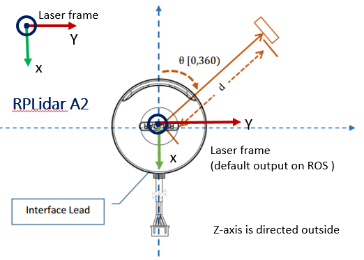
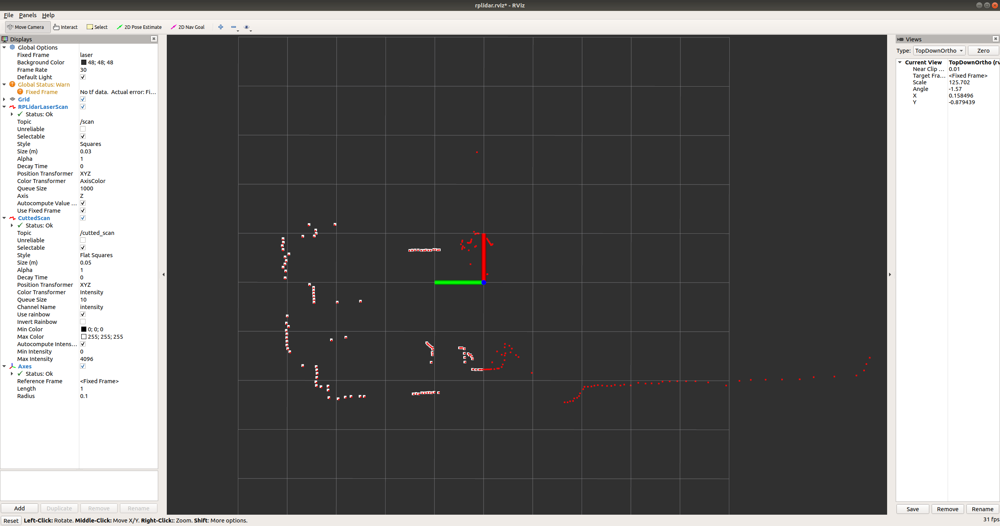

# SCAN_CUTTER雷达扫描数据截取程序

## 简介

该程序包实现了在ROS环境下，截取用户指定范围内的rplidar的激光雷达数据。

根据用户需要设置最大最小扫描角度（-180°～180°），设置最大最小扫描距离(0~最大扫描距离)，将rplidar激光雷达发出的/scan(sensor_msgs/LasersScan)消息处理之后，发布到话题/cutted_scan(sensor_msgs/LasersScan)。

## 程序设计

程序设计方法为新开一个ROS节点scan_cutter，该节点订阅激光雷达节点rplidarNode发布的/scan话题，经过按照用户指定参数处理之后，发布到新的话题/cutted_scan上，发布频率与原始雷达数据消息频率保持一致。

ROS的节点消息图如下所示：


雷达的正方向为：



即数据线出来的方向为雷达的正方向，也就是0°的方向。

## 程序实现

具体的程序实现如下，细节已在代码中注释，请查看。

```cpp
//引入ROS的头文件和雷达消息格式头文件
#include "ros/ros.h"
#include "sensor_msgs/LaserScan.h"

//设置变量，用于存储参数
double min_angle, max_angle;
double min_range, max_range;
//设置截取后的雷达消息数据
sensor_msgs::LaserScan cutted_scan;
//设置发布消息变量，此处需设置为全局变量，以供scanCallback函数内使用，否则在main函数中的变量无法传到scanCallback函数中
ros::Publisher cutted_scan_pub;
//处理雷达数据消息/scan的回调函数，核心处理函数
void scanCallback(const sensor_msgs::LaserScanPtr& msg) {
  //    设置固定字段数据与原始/scan消息一致
  cutted_scan.time_increment = msg->time_increment;
  cutted_scan.angle_increment = msg->angle_increment;
  cutted_scan.header.frame_id = msg->header.frame_id;
  cutted_scan.header.stamp = ros::Time::now();
  //  清除上一帧数据，因为cutted_scan为全局变量，不清除继续push则会叠加
  cutted_scan.ranges.clear();
  //  截取后的自增数据下标
  int cutted_i = 0;

  //  主循环，处理每一帧数据
  for (int i = 0; i < msg->ranges.size(); i++) {
    //      数据小于设置的最小角度，跳过
    if (msg->angle_min + i * msg->angle_increment < min_angle) {
      continue;
    }
    //      数据大于设置的最小角度，跳过
    if (msg->angle_min + i * msg->angle_increment > max_angle) {
      continue;
    }
    //      数据距离大于设置的最大距离，赋值无穷远（ROS雷达数据约定）
    if (msg->ranges[i] > max_range) {
      cutted_scan.ranges.push_back(INFINITY);
      cutted_i++;
      continue;
    }
    //    数据距离小于设置的最小距离，赋值最小距离
    if (msg->ranges[i] < min_range) {
      cutted_scan.ranges.push_back(min_range);
      cutted_i++;
      continue;
    }
    //    其余的都是合法数据，无需处理直接入队
    cutted_scan.ranges.push_back(msg->ranges[i]);
    cutted_i++;
  }
  //  处理完数据后发布截取的雷达数据
  cutted_scan_pub.publish(cutted_scan);
}

int main(int argc, char** argv) {
  //    开辟节点scan_cutter
  ros::init(argc, argv, "scan_cutter");
  //  建立节点的nodeHandle
  ros::NodeHandle nh("~");
  //  获取参数min_angle
  nh.param("min_angle", min_angle, -3.14);
  //  验证参数min_angle的合法性，不合理则设为给定值
  if (min_angle < -3.14) {
    min_angle = -3.14;
  } else if (min_angle > 3.14) {
    min_angle = 3.14;
  }
  //  获取参数max_angle
  nh.param("max_angle", max_angle, 3.14);
  //  验证参数max_angle的合法性，不合理则设为给定值
  if (max_angle > 3.14) {
    max_angle = 3.14;
  } else if (max_angle < -3.14) {
    max_angle = -3.14;
  }
  //  获取参数min_range
  nh.param("min_range", min_range, 0.1);
  //  验证参数min_range的合法性，不合理则设为给定值
  if (min_range < 0.0) {
    min_range = 0.0;
  }

  //  获取参数max_range
  nh.param("max_range", max_range, 10.0);
  //  验证参数max_range的合法性，不合理则设为给定值
  if (max_range < 0.1) {
    max_range = 0.1;
  }
  //  调试信息，打印所设置的参数，确保程序获取到
  ROS_INFO_STREAM("min_angle: " << min_angle << "\n max_angle: " << max_angle
                                << "\n min_range: " << min_range
                                << "\n max_range: " << max_range);
  //  设置截取后的scan消息的固定字段数值
  cutted_scan.angle_min = min_angle;
  cutted_scan.angle_max = max_angle;
  cutted_scan.range_min = min_range;
  cutted_scan.range_max = max_range;

  //  注册订阅消息/scan
  ros::Subscriber scan_sub = nh.subscribe("/scan", 1000, scanCallback);
  //  注册发布消息/cutted_scan
  cutted_scan_pub = nh.advertise<sensor_msgs::LaserScan>("/cutted_scan", 1);

  //  保持该程序持续运行，ROS机制，类似于while(1)死循环
  ros::spin();

  return 0;
}


```

## 文件目录

```
.
├── CMakeLists.txt
├── imgs
│   ├── rosgraph.png
│   ├── rplidar_A2.png
│   └── two_scan.png
├── include
│   └── scan_cutter
├── launch
│   ├── include
│   │   ├── rplidar.launch
│   │   └── rplidar_s1.launch
│   └── scan_cutter.launch
├── package.xml
├── README.md
├── rviz
│   └── rplidar.rviz
├── src
│   └── scan_cutter_node.cpp
└── tree.txt

7 directories, 12 files
```


## 程序依赖

请确保您的运行环境如下：

1. Ubuntu18.04
2. ROS
3. rplidar_ros

安装rplidar_ros的方法为：

```
sudo apt install ros-melodic-rplidar-ros -y
```


## 程序运行

将下载仓库程序压缩包scan_cutter.zip解压到工作空间，或者clone该仓库：

```bash
git clone https://github.com/yowlings/scan_cutter.git
```


修改文件scan_cutter.launch中的参数

```xml
<launch>
  <param name="/use_sim_time" value="false">
  </param>
  <!-- launch rplidar s1/A2 driver -->
  <include file="$(find scan_cutter)/launch/include/rplidar.launch">
  </include>
  <!-- include file="$(find scan_cutter)/launch/include/rplidar_s1.launch">
  </include -->
  <node name="scan_cutter" output="screen" pkg="scan_cutter" type="scan_cutter_node">
    <param name="min_angle" value="0.78">
    </param>
    <param name="max_angle" value="3.14">
    </param>
    <param name="min_range" value="0.1">
    </param>
    <param name="max_range" value="12.0">
    </param>
  </node>
  <node args="-d $(find scan_cutter)/rviz/rplidar.rviz" name="rviz" pkg="rviz" type="rviz">
  </node>
</launch>
```

程序默认使用rplidar A1/A2/A3，如使用rplidar S1则请注释5-6行，解注释7-8行。

编译后运行：

```
roslaunch scan_cutter scan_cutter.launch
```

## 实现效果



图中红色的点为原始雷达数据/scan，白色的点为截取后的雷达数据/cutted_scan，截取参数如下。

```
<param name="min_angle" value="0.78">
</param>
<param name="max_angle" value="3.14">
</param>
<param name="min_range" value="0.1">
</param>
<param name="max_range" value="12.0">
</param>
```

## ROS参数与话题

### 参数：

1. min_angle（最小扫描角度）
2. max_angle（最大扫描角度）
3. min_range（最小扫描距离）
4. max_range（最大扫描距离）

### 订阅的话题

/scan(sensor_msgs/LasersScan)

### 发布的话题

/cutted_scan(sensor_msgs/LasersScan)

### 服务

None


